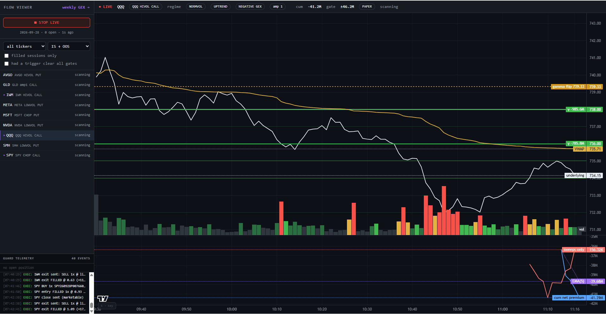
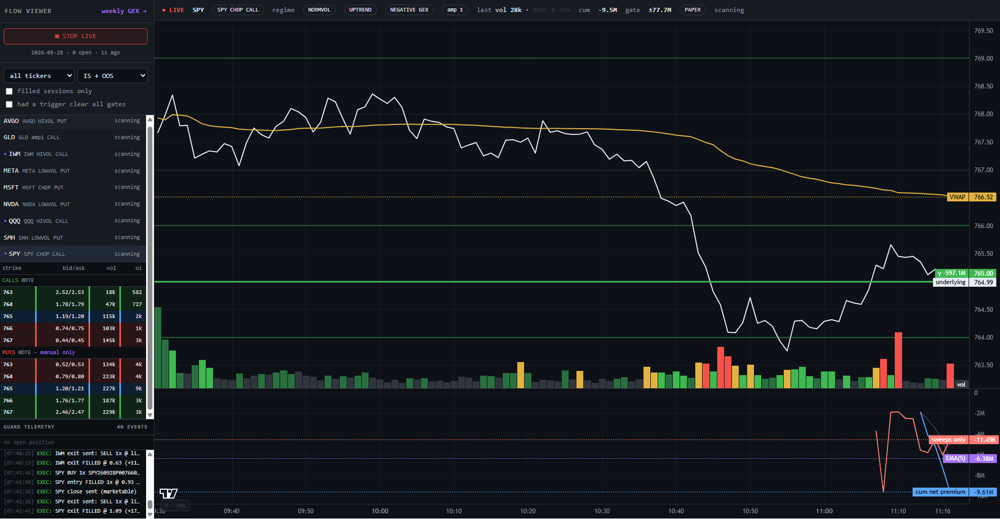
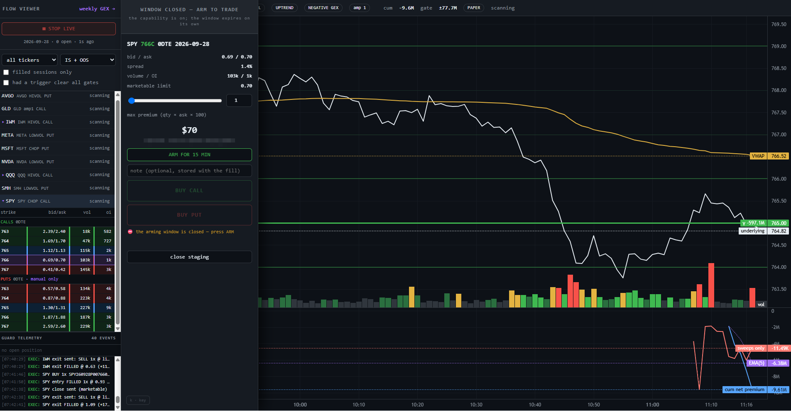
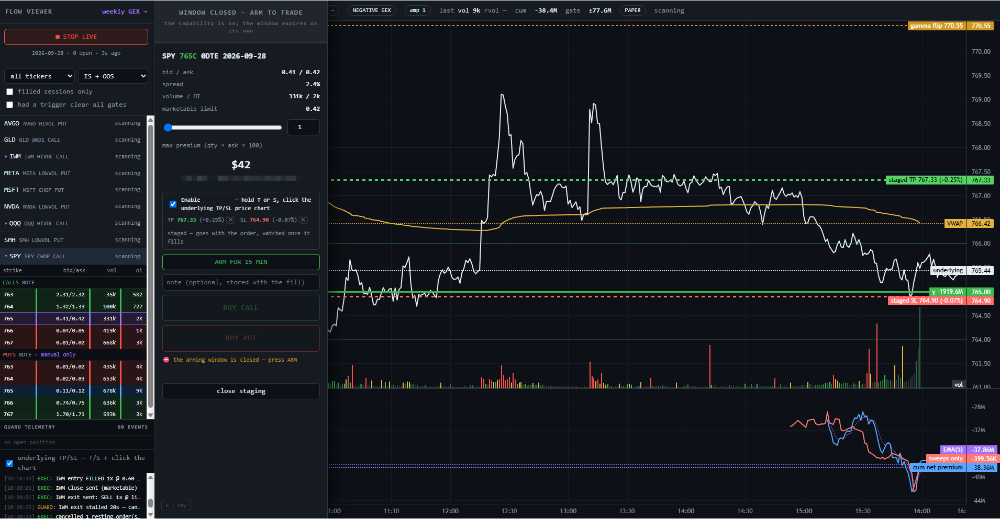
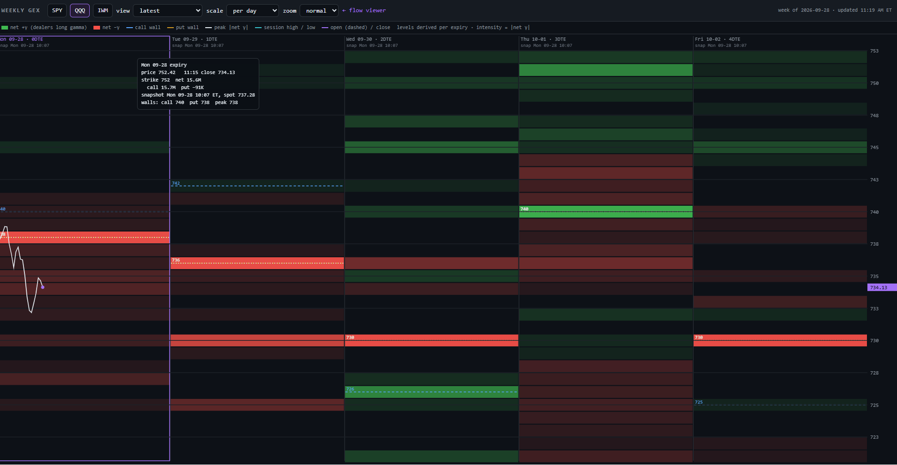

# Cleanbot

A directional 0DTE/1DTE options bot and the research toolkit that produced it.

The bot reads options order flow from [Unusual Whales](https://unusualwhales.com),
takes a position when cumulative intraday net premium crosses its own moving
average and the move clears a percentile gate, executes through Webull, and
manages the exit with a bracket. Around it sits ~180 single-purpose research
scripts — each one a hypothesis with a stated prior and a falsification
condition — plus a browser chart for watching the tape live and placing
discretionary orders by hand.

---

## ⚠️ Read this before running anything

**This software places real orders with real money.** It is published as a
record of a method, not as a product, and it carries no warranty of any kind.

- **There are no performance claims here.** Nothing in this repository asserts
  that the strategy is profitable. `FORWARD_SHOOTOUT.md` and `PRESAMPLE_PLAN.md`
  are pre-registered tests, written before the data was scored, and both are
  still substantially unrun. Read them for what is and is not established.
- **`DRY_RUN=true` is the default and nothing overrides it silently.** The bot
  sends no orders until you set it to `false` yourself.
- **Options can expire worthless.** 0DTE positions can lose their entire premium
  in minutes, and the exit logic depends on a bracket that the broker may not
  fill at the price you asked for. A limit price is not the price you get.
- Nothing here is financial, legal or tax advice, and the authors are not your
  broker, adviser or counterparty.

Trade paper first, for longer than feels necessary.

---

## 🔒 Hyperliquid perpetuals are locked, deliberately

The repository contains a Hyperliquid client (`hyper_exposure_client.py`) used by
an experimental delta-hedging engine. **It is disabled by default and cannot be
enabled by accident.**

```sh
python hl_gate.py      # prints the legal notice and the current arm state
```

Hyperliquid perpetual futures are leveraged derivatives on an offshore exchange
that is not registered with the CFTC. **For US persons, trading them is
generally not lawful** unless you meet the "eligible contract participant"
threshold — an asset-based test that ordinary retail traders do not meet.
Hyperliquid's own terms of service separately restrict US persons. Using a VPN
or a non-US wallet to get around that does not make it lawful and may add
offences of its own.

Enabling it therefore requires **two independent things**: a capability flag
*and* a copied-out legal attestation, on top of the global `DRY_RUN`, a
per-order notional cap and an explicit coin allow-list. Every limit fails
closed — an unset cap refuses everything rather than permitting anything. The
full reasoning is in the module docstring of [`hl_gate.py`](hl_gate.py).

**The rest of the toolkit does not need it.** Nothing in `bot_runner.py`'s path
imports Hyperliquid. If you are not certain you are eligible, leave every
`HL_*` variable unset and everything else works exactly as documented.

---

## Screenshots

**Live flow viewer (`flow_viewer.html`), QQQ.** Price with session VWAP,
the 0–1DTE gamma heat by strike and the gamma flip, volume bars shaded by
relative volume, and below them the flow pane the bot trades on: cumulative
net premium, its EMA(5), and sweeps-only flow.



**Strike strip.** Each tradeable ETF drops down to its live basket — the
0DTE calls a rule trades and the puts kept for discretionary orders — with
bid/ask, volume and open interest, re-centred on spot as price moves.



**Staging a manual order.** A marketable limit, the maximum premium it can
commit, and a 15-minute arming window that has to be opened before any order
can leave. (The account figure under the premium is blurred.)



**Underlying TP/SL.** With it enabled, T + click on the price chart sets a
take-profit and S + click a stop-loss at that UNDERLYING price — on a live
manual hold, or, as here, staged with an order (dashed until it fills). The
bot watches the levels itself, needs price through a level for 2 seconds
before acting, and closes marketable with the same 911 escalation as the
Close button. A level on the wrong side of spot for the option's direction
is refused. (The account figure under the premium is blurred.)



**Weekly GEX (`weekly_gex.html`).** The week's 0–4DTE gamma map: one column
per trading day, each drawn from that day's expiry as snapshotted each
morning, with walls and peak derived per expiry and the price line walking
across the week.



## Quick start

```sh
git clone <this repo> && cd Cleanbot
python -m venv venv && venv/bin/pip install -r requirements.txt

cp .env.example .env        # then fill in UW_API_KEY at minimum
python bot_runner.py        # DRY_RUN is on by default
```

Then, in another shell:

```sh
python serve_viewer.py      # chart on http://127.0.0.1:8765/flow_viewer.html
```

You need an Unusual Whales subscription for the flow data. Webull OpenAPI
credentials are needed only to execute; without them the bot runs read-only.
The research scripts read a local parquet lake built by
`uw_options_data_lake.py` — see `PRESAMPLE_PLAN.md` for what that costs in API
calls and time.

### Safety flags

| variable | default | what it governs |
|---|---|---|
| `DRY_RUN` | `true` | the **bot's** own orders. Nothing is sent while true. |
| `PAPER_TRADING` | `false` | routes Webull to its sandbox endpoint |
| `MANUAL_TRADING_ARMED` | `false` | the discretionary desk in the viewer — a *capability*, separate from `DRY_RUN` on purpose |
| `HL_TRADING_ENABLED` | `false` | Hyperliquid perps. See above; needs `HL_LEGAL_ACK` too. |

Two things are deliberately **not** gated on any of these: exits of positions
you actually hold, and the 15:55 flatten. A real position always gets a real
exit — otherwise a flag you toggled at lunchtime could trap you in a trade.

---

## Layout

**Live path**

| file | role |
|---|---|
| `bot_runner.py` | the engine: flow triggers, sizing, entries, brackets, the EOD flatten |
| `config.py` | single source of truth for every safety toggle and every deployed rule |
| `manual_orders.py` | the discretionary desk — caps, price collars, arming window, 911 flatten |
| `webull_gamma_client.py` | Webull OpenAPI + MQTT quotes |
| `unusual_whales_client.py`, `uw.py` | the flow API |
| `live_state.py`, `serve_viewer.py`, `flow_viewer.html` | the live chart and order UI |
| `peer_guard.py` | refuses to start a second engine against one brokerage account |
| `hl_gate.py`, `hyper_exposure_client.py` | Hyperliquid, locked (see above) |

**Research** — `sim_core.py` is the only simulator; every `check_*.py` should
route through it. `SCRIPTS.md` indexes all of them, generated from their
docstrings.

**Docs**

- [`METHODOLOGY.md`](METHODOLOGY.md) — how to test an idea here without fooling
  yourself. Every rule in it was learned by getting it wrong first, and the cost
  of each mistake is recorded so the rule does not get quietly dropped.
- [`PRESAMPLE_PLAN.md`](PRESAMPLE_PLAN.md), [`FORWARD_SHOOTOUT.md`](FORWARD_SHOOTOUT.md)
  — pre-registered holdout tests.
- [`deploy/README.md`](deploy/README.md) — running bot and viewer on a cloud box
  over Tailscale, and why `/order` must never bind `0.0.0.0`.

---

## A note on the comments

Many comments in this codebase are long, start with 🚨, and carry a date. That
is on purpose. Nearly every bug found here had the same shape — something
returned empty, stale or blind, and nothing distinguished that from a correct
answer. A quote read from fields that did not exist returned `(0.0, 0.0)`, so
every option looked worthless. An HTTP 429 read as "still working". A config
file with a byte-order mark failed to parse, every reader fell back to a default,
and the order-signing secret came back `None`.

Those failures are invisible in the code that caused them and obvious in the
code that fixed them, so the fix carries the reason. If a comment tells you why
a line looks strange, it is load-bearing — check the claim before you simplify it
away.

---

## Data you need

| source | used for | cost |
|---|---|---|
| Unusual Whales | options flow, GEX, dark pool, the entire signal | subscription |
| Webull OpenAPI | execution, option quotes over MQTT | free with an account |
| Databento | MBO order-book research only (`fetch_mbo.py`, `check_book_*.py`) | paid, optional |

Nothing in the live path needs Databento.

---

## License

**Apache-2.0** — see [`LICENSE`](LICENSE) and [`NOTICE`](NOTICE).

Sections 7 and 8 of that license disclaim all warranties and all liability, and
they mean it literally here: this software places real orders and can lose you
money. Read the risk section above.

### Not in this repository

Two things the authors run locally are deliberately excluded, and the code that
depends on them needs you to supply your own copy. Both are explained in
[`NOTICE`](NOTICE).

- **`rithmic_protos/`** — Rithmic's protobuf schema, distributed to their own API
  customers under their agreement. `rithmic_streamer.py` ships and expects you to
  regenerate the bindings from the schema Rithmic gives you. Nothing in the
  directional bot touches this path.
- **`smart_money_flow.py`** and its test — a port of a TradingView Pine script
  licensed CC BY-NC-SA 4.0. A port is a derivative work, so the NonCommercial and
  ShareAlike terms follow it and conflict with Apache-2.0. Excluded rather than
  relicensed; the research finding it produced is recorded in `METHODOLOGY.md`.

### Services, not dependencies

This is a client for Unusual Whales, Webull, Hyperliquid, Databento, Rithmic and
Telegram. It is not affiliated with or endorsed by any of them. Each needs your
own account, and each has its own terms and market-data agreements that this
license does not grant you anything under.

---

## Contributing

Two conventions matter more than style here:

1. **Do not weaken a default.** Every limit in this repo fails closed, and
   several of them do so because the open version cost real money once.
2. **If you fix something subtle, leave the reason.** A comment saying what the
   code does is noise; one saying what it *used to do wrong* is the only thing
   that stops the fix being reverted.
